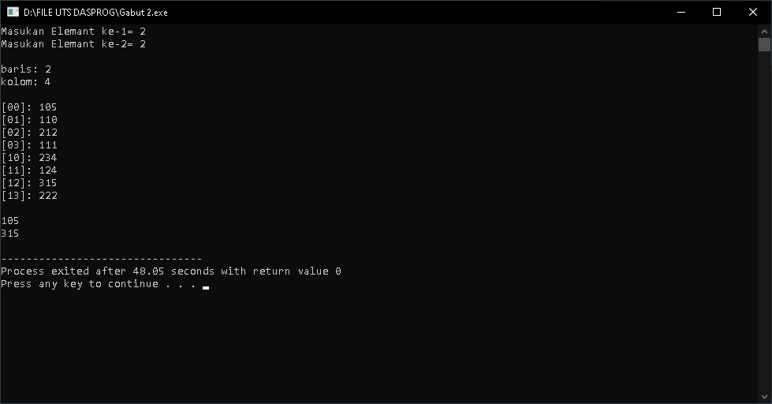

# Ujian Akhir Semester 
<br>Mata Kuliah&ensp;&ensp; : Dasar Pemrograman
<br>Nama&ensp;&ensp;&ensp;&ensp;&ensp;&ensp;&ensp;&nbsp;: MUHAMAD NOPID ANDRIANSYAH
<br>NIM&emsp;&emsp;&emsp;&emsp;&nbsp; : 1227050091
<br>Jurusan&emsp;&emsp;&emsp;: [Teknik Informatika](http://if.uinsgd.ac.id/) [UIN Sunan Gunung Djati Bandung](https://uinsgd.ac.id/)d.ac.id/) [UIN Sunan Gunung Djati Bandung](https://uinsgd.ac.id/) 

## Deskripsi Umum

## Source Code
```
#include <iostream>
using namespace std;

int main()
{
	int awal,akhir;
	cout << "Masukan Angka Awal= ";;
	cin >> awal;
	cout << "Masukan Angka Akhir= ";
	cin >> akhir; 
	
    for (int i = awal; i <=akhir; i++) {
        if (i % 3 == 0 || i % 5 == 0 || i % 7 == 0) {
            cout << i << endl;
        }
    }
    return 0;
}
```
## Output



